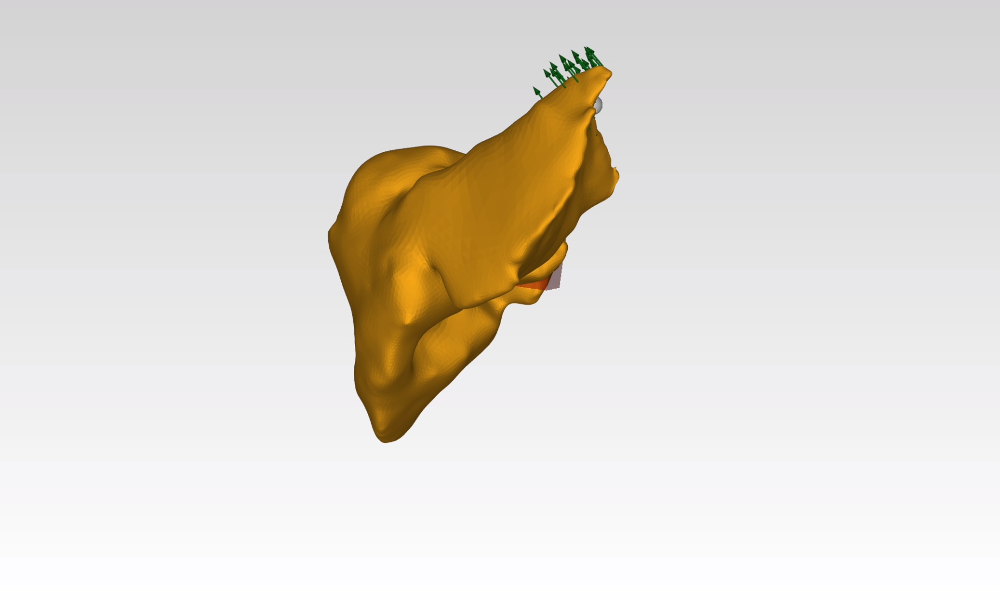

## DeepPhysX


### Interfacing AI with simulation

The **DeepPhysX** project provides Python packages allowing users to easily interface their **numerical simulations**
with **learning algorithms**.

### Features

**DeepPhysX** is a full Python3 projects with the following main features:
* Generate a dataset with synthetic data from numerical simulations;
* Train an artificial neural network with a synthetic dataset;
* Use the predictions of a trained network in a numerical simulation.

The full list of features is detailed in the [**documentation**](https://mimesis-inria.github.io/DeepPhysX/).

### Quick install

<<<<<<< HEAD
The project was initially developed using [SOFA](https://www.sofa-framework.org/) as the **simulation package** and
[PyTorch](https://pytorch.org/) as the **AI framework**. 
Thus, **DeepPhysX** is mainly designed for these frameworks, but obviously **other frameworks** can also be used.
The packages corresponding to these frameworks will therefore be used for the default installation.

The easiest way to install is using `pip`, but there are a several way to install and configure a **DeepPhysX**
environment (refer to the [**documentation**](https://mimesis-inria.github.io/DeepPhysX/) 
for further instructions).

=======
>>>>>>> 0ea7c8f2e85ea2b52a4c2485e41048d4d55d521d
``` bash
# Option 1 (USERS): install with pip
$ pip install git+https://github.com/mimesis-inria/DeepPhysX.git

# Option 2 (DEVS): install as editable
$ git clone https://github.com/mimesis-inria/DeepPhysX.git
$ cd DeepPhysX
$ pip install -e .
```
<<<<<<< HEAD


### Demos

**DeepPhysX** includes a set of detailed tutorials, examples and demos.
As these scripts are producing data, they cannot be run in the python site-packages, thus they should be run locally.
Use the *command line interface* to get the examples or to run **interactive demos**:

``` bash
$ DPX --get             # Get the full example repository locally
$ DPX --run <demo>      # Run one of the demo scripts
```

|          **Armadillo**<br>`DPX -r armadillo`          |          **Beam**<br>`DPX -r beam`          |          **Liver**<br>`DPX -r liver`          |
|:-----------------------------------------------------:|:-------------------------------------------:|:---------------------------------------------:|
|  |  |  |


### References

Did this project help you for your research ? Please cite us as:

R. Enjalbert, A. Odot and S. Cotin, *DeepPhysX, a python framework to interface AI with numerical simulation*, 
Zenodo, 2022, [**DOI**](https://doi.org/10.5281/zenodo.7389505)
=======
>>>>>>> 0ea7c8f2e85ea2b52a4c2485e41048d4d55d521d
