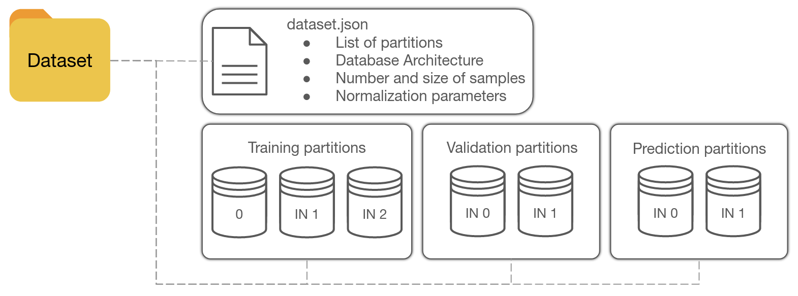

CORE - Using a Dataset
======================

Dedicated code in :guilabel:`Core/Dataset` module.

Behavior
--------

**DeepPhysX** comes with its own *Dataset* management system, using the features from the :SSD:`SSD <>` library.
The synthetic data produced in *Environments* is stored on a *Database* that is in a dedicated repository named
``dataset`` in the training session.
Data is stored as partitions: these partitions correspond to the different *Dataset* modes (training data, test data,
prediction data) and can be multiple for each data field in order not to exceed the maximum size of the current amount
of loaded data.
Each partition will have a unique name: ``<session_name>_<dataset_mode>_<field>_<index>.npy``.

    Dataset repository organisation.

When adding a batch to the *Dataset*, a new partition is created for each data field if the current *Dataset* size
exceeds the threshold.
The batch is then appended to the *Dataset* for each data field.
Default *Dataset* fields are inputs and outputs, but users can define any data field from *Environment*
(see :ref:`dedicated section <environment-implementation>`).
Each field must always be filled at each batch.
A ``dataset.json`` file gathers information about the produced dataset and normalization coefficients if the
normalization is applied.

When loading data from an existing *Dataset*, the partitions are loaded and can be accessed randomly or not among the
whole set of partitions.

Configuration
-------------

A *Dataset* is almost always used in DeepPhysX pipelines and requires a *DatasetConfig*.
This *Configuration* object role is to bring together all the options to configure the *Dataset* and to create it with
``create_dataset`` method.

Here is a description of attributes related to *Dataset* configuration.

.. list-table::
    :width: 100%
    :widths: 15 85

    * - ``existing_dir``
      - Path to an existing *Dataset* repository if this repository needs to be loaded or completed.

    * - ``max_file_size``
      - Maximum size (in Gb) of the total *Dataset* object.

    * - ``mode``
      - Specify the *Dataset* mode between "Training", "Validation" and "Running".

    * - ``normalize``
      - If True, normalization parameters are computed from training data and applied to any loaded data.

    * - ``shuffle``
      - Specify if the loading order is random or not (True by default).

.. highlight:: python

See following example::

    # Import DatasetConfig
    from DeepPhysX_Core.Database.BaseDatabaseConfig import BaseDatabaseConfig

    # Create the config
    database_config = BaseDatabaseConfig(max_file_size=1,
                                         shuffle=True,
                                         mode='Training',
                                         normalize=True)
