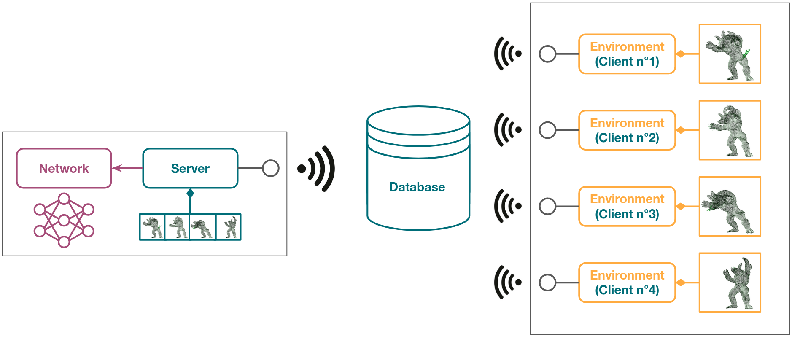

CORE - Using an Environment
===========================

Dedicated code in :guilabel:`Core/Environment` and :guilabel:`Core/AsyncSocket` modules.

.. _environment-implementation:

Implementation
--------------

An *Environment* can be considered either as a *TcpIpClient* (communication with the *EnvironmentManager* through a
*TcpIpServer*, see :ref:`dedicated section <environment-tcpip>` below) or not (direct communication with the
*EnvironmentManager*).
Yet, the user API will be the same if the *Environment* is a *TcpIpClient* entity or not, so that the user can
implement its *Environment* regardless of this dependence.

| **Mandatory methods**
| The following methods must be implemented.

.. list-table::
    :width: 100%
    :widths: 15 85

    * - ``create``
      - Create the simulation.

        This method is automatically called when the *Environment* component is created.

    * - ``step``
      - Describe the transitions between simulation states.

        This method is automatically called when the *Pipelines* require a step in the simulation to produce a
        data sample.

| **Optional methods**
| Additional non mandatory methods can be implemented to describe the simulation behavior.

.. list-table::
    :width: 100%
    :widths: 15 85

    * - ``init``
      - Initialize the simulation.

        In some cases, the simulation components might need to be initialized in addition to being created.

        This method is automatically called when the *Environment* component is created, right after the create
        method.

    * - ``recv_parameters``
      - In the case of using multiple *Environments* connected to one *TcpIpServer*, each of them can be parameterize
        differently.

        These parameters can be set in the *EnvironmentConfig* and are then automatically sent to *Environments* right
        after their initialization.

    * - ``send_parameters``
      - On the other side, one might want to send back data from *Environments* to the *EnvironmentConfig*.

        If the method is implemented, parameters will be sent right after the previous receipt.

    * - ``check_sample``
      - Each step will be followed by a sample checking.

        This check returns True by default but samples can be sorted and then not added to the *Dataset* if they do not
        meet some criteria.

    * - ``apply_prediction``
      - In some use cases, the *Network* predictions can be sent back to the *Environment* to be applied in the
        simulation.

        This method describes how the prediction must be used in the simulation.

    * - ``close``
      - For some reasons, the simulation might need to perform some tasks before being shut down.

        These tasks can be done in the close method which is automatically called before shut down.

| **Data producing methods**
| The following methods are dedicated to data producing /exchange.

.. list-table::
    :width: 100%
    :widths: 15 85

    * - ``set_training_data``
      - This method defines which data will be considered as training data (data sent to the *NetworkManager* to feed
        the *Network*).

    * - ``set_loss_data``
      - This method allows adding specific data to compute the loss function with numeric values from the simulation.

    * - ``set_additional_dataset``
      - In addition to the training data, some additional data can be sent directly to the dataset to replay some
        simulation states.

        This method adds a new field to the *Dataset* and must be then called at each step.

    * - ``set_dataset_sample``
      - This method is already implemented and must not be overwritten by the user.

        When loading existing data, the *DataManager* might need to send *Dataset* samples to the *Environment* to
        produce training data.

        These samples are set in the variables ``sample_in`` & ``sample_out``.

        If *Dataset* has additional data fields, these additional fields are set in ``additional_inputs`` &
        ``additional_outputs``.

        Each sample can then be processed in the step function.

| **Requests**
| The *Environment* is also able to perform some requests. These requests are sent either directly to the
  *EnvironmentManager* or through a *TcpIpServer*.

.. list-table::
    :width: 100%
    :widths: 15 85

    * - ``get_prediction``
      - Depending on the application, a prediction of the *Network* can be useful before the end of a step.

        By default, a *Network* computes predictions after a simulation step, so the only way to get one during a step
        is by this request.

        The training data must obviously be set before triggering this request.

    * - ``send_visualization``
      - The framework comes with an integrated *Visualizer* tool to render some components of the simulation.

        Parts of the simulation to render must be defined when creating or when initializing the *Environment*.

        An *Environment* has a visualization factory to easily create visualization data from templates with
        ``addObject`` method.

        User only has to set the object type and to fill the required fields to init this type of object in the
        *Visualizer* (see :ref:`dedicated section <visualizer-howto>`).

    * - ``update_visualization``
      - If a *Visualizer* was created, it must be manually updated at each step by sending the updated state of
        the simulation.

        The factory allows to easily create updated visualization data from objects ids with ``updateObject_dict``
        method.

        User only has to fill the object id (same as initialization order) and the required fields (detailed for each
        object in :ref:`dedicated section <visualizer-howto>`).

Configuration
-------------

Using an *Environment* in one of the **DeepPhysX** *Pipeline* always requires an *EnvironmentConfig*.
This component’s role is both to bring together all the options for configuring an *Environment* and to either create
an instance of a single *Environment* or launch a *TcpIpServer* with several *TcpIpClients*.
In the first case, the single *Environment* will simply be created within the ``create_environment`` method, while in
the other case, the ``create_server`` method will simply create and launch a *TcpIpServer* and then start several
subprocesses, each using the ``launcherBaseEnvironment.py`` script to create and launch an *Environment* as a *Client*.

| **Simulation parameters**
| Here is a description of attributes related to a base *Configuration*.

.. list-table::
    :width: 100%
    :widths: 15 85

    * - ``environment_class``
      - The class from which an *Environment* will be created.

        The attribute requires the class and not an instance, as it will be automatically created as explained above.

    * - ``visualizer``
      - A visualization tool is provided, which renders the specified parts of each *Environment*.

        If no *Visualizer* is provided, the pipeline will run without any render window.

    * - ``simulations_per_step``
      - The number of iterations to compute in the *Environment* at each time step.

        An *Environment* will compute one iteration by default.

    * - ``use_prediction_in_environment``
      - Each *Network* prediction will be automatically applied in the *Environment* if this flag is set to True
        (set to False by default).

| **Data parameters**
| Here is a description of attributes related to sample generation.

.. list-table::
    :width: 100%
    :widths: 15 85

    * - ``always_create_data``
      - This flag is useful for the training *Pipeline*.

        If False (by default), the *DataManager* requests batches to the *Environment* during the first epoch and
        reload them next.

        If set to True, the *DataManager* requests new batches to the *Environment* during the whole training session.

    * - ``screenshot_sample_rate``
      - This option is only available if a *Visualizer* is defined.

        In addition to *Dataset* partitions, samples can also be saved as screenshots so representative ones can be
        easily found.

        A screenshot of the viewer will be taken every x samples (set to 0 by default).

    * - ``record_wrong_samples``
      - By default, only the good samples are stored in the *Dataset* (sorted by check_sample, see the section above).

        If this flag is set to True, the wrong samples will also be saved to dedicated partitions.

    * - ``max_wrong_samples_per_step``
      - If an *Environment* produces too many wrong samples, it may be configured incorrectly.

        To avoid an unnecessary extended data generation, a threshold can be set so that the session can be stopped
        early.

        This happens when too many wrong samples are produced to fill a single batch.

| **TcpIP parameters**
| Here is a description of attributes related to the *Client* configuration.

.. list-table::
    :width: 100%
    :widths: 15 85

    * - ``as_tcp_ip_client``
      - Defines if the *Environment* will be launched as a *Client* (True by default) or directly connected to its
        *EnvironmentManager*.

        Note: In the prediction *Pipeline*, only one *Environment* will be used, so the value of this flag is ignored.

    * - ``ip_address``
      - Name of the IP address to bind *TcpIpObjects*.

        The default value is “localhost” to host the *Server* and *Clients* locally.

    * - ``port``
      - TCP port’s number through which *TcpIpObjects* will communicate (10000 by default).

    * - ``environment_file``
      - When launching an *Environment* as a *Client*, the *EnvironmentConfig* starts a subprocess involving that
        *Environment*.

        To do this, the launcher will need the script path in which the *Environment* is defined.

        This script is in most cases automatically detected, but users may need to enter the path to their python file.

    * - ``number_of_thread``
      - The number of *Environments* to launch simultaneously if the flag ``as_tcp_ip_client`` is True.

    * - ``max_client_connection``
      - The maximum number of *Client* connections allowed by a *Server*.

    * - ``param_dict``
      - *Environments* can receive additional parameters if they need to be parameterized differently.

        These parameters are sent in the form of dictionaries by the *Server* when creating the *Environment*.

.. highlight:: python

See following example::

    # Import EnvironmentConfig and Visualizer
    from DeepPhysX_Core.Environment.BaseEnvironmentConfig import BaseEnvironmentConfig
    from DeepPhysX_Core.Visualizer.VedoVisualizer import VedoVisualizer

    # Create the config
    env_config = BaseEnvironmentConfig(environment_class=MyEnvironment,
                                       visualizer=VedoVisualizer,
                                       as_tcp_ip_client=True,
                                       number_of_thread=5,
                                       ip_address='localhost',
                                       port=10000)

.. _environment-tcpip:

Client-Server Architecture
--------------------------

**DeepPhysX** allows users to run several *Environments* in **multiprocessing** to speed up data generation.
The :guilabel:`Core/AsyncSocket` module defines a **Client-Server architecture** where a *TcpIpServer* communicates
with several *TcpIpClients* using a **TcpIp protocol**.

    Client-Server Architecture

At the beginning of data generation, a *TcpIpServer* is launched by the *EnvironmentConfig*.
This *TcpIpServer* binds to the socket with the configured IP address on the configured port and then listens for
*TcpIpClients*.
To launch *TcpIpClients*, the *EnvironmentConfig* runs sub-processes where a launcher is called.
This launcher creates a *TcpIpClient* instance, this *TcpIpClient* is then bound to the socket with the configured IP
address on the configured port.
Once the *TcpIpClients* are all connected to the *TcpIpServer*, initialization is performed to create all the
*Environments* and initialize the parameters exchanges.
*TcpIpClients* are now ready to communicate with the *TcpIpServer* to handle the data generation.
Finally, the *TcpIpServer* triggers the shutdown of each *TcpIpClient* and closes the socket.

Both *TcpIpServer* and *TcpIpClient* inherit from *TcpIpObject* to access low levels of sending and receiving data on
the socket.
The data is sent as a custom bytes message converted with a *BytesConverter*, which handles Python common types and
NumPy arrays.
On top of these low level data exchange methods are built higher level protocols to send labeled data, labeled
dictionaries and commands.

A list of available commands is defined. *TcpIpServer* and *TcpIpClients* have then their own action implementations
to perform when receiving a command:

* A *TcpIpClient* defines the following actions to perform on commands:

  .. list-table::
      :width: 90%
      :widths: 15 85

      * - ``exit``
        - Set the closing flag to True to terminate the communication loop.

      * - ``prediction``
        - Receive the prediction sent by the *TcpIpServer* and apply it in the *Environment*.

      * - ``sample``
        - When using data from *Dataset*, the sample is received and defined in the *Environment* on this command

      * - ``step``
        - Trigger a simulation step to produce data.

          Data should be sent to the *TcpIpServer* when the produced sample is identified as usable by sample
          checking.

* A *TcpIpServer* defines the following actions to perform on commands:

  .. list-table::
      :width: 90%
      :widths: 15 85

      * - ``prediction``
        - Receive data to feed the *Network*, then send back the prediction to the same *TcpIpClient*.

      * - ``visualization``
        - Receive initial or updated visualization data, then call the *Visualizer* update.
