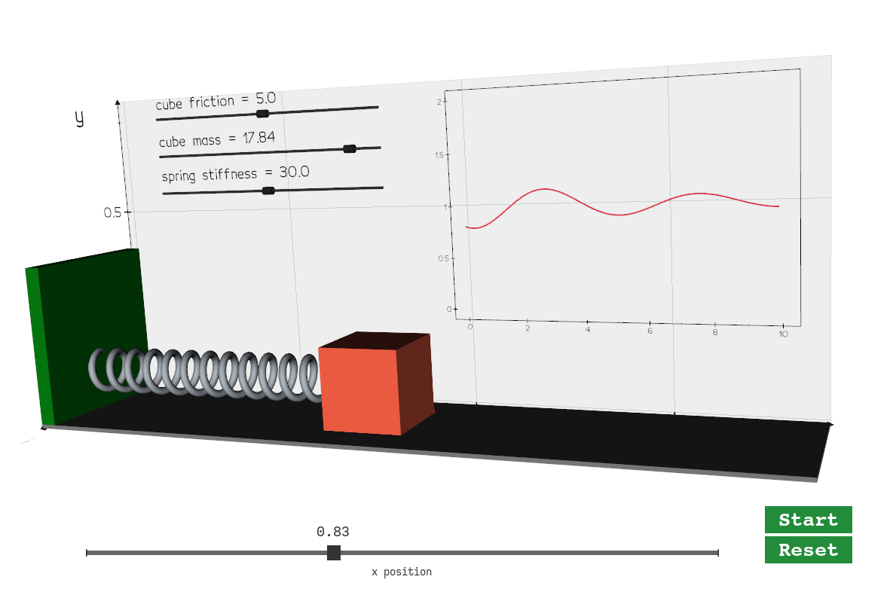

# Tutorial

This repository is a first simple example where we train a neural network to predict the behavior of a mass-spring 
system, depending on the stiffness of the spring, the mass of the cube and the friction.

## Description

Python scripts should be explored in the following order:
* **#01** `scenario.py`: an interactive simulation to understand the system
* **#02** `simulation.py`: the definition of our training Simulation in a DeepPhysX compatible implementation
* **#03** `data_generation.py`: run the data generation pipeline using the numerical simulation
* **#04** `training.py`: run the training pipeline using the generated samples
* **#05** `prediction.py`: run the prediction pipeline to display the trained network predictions
